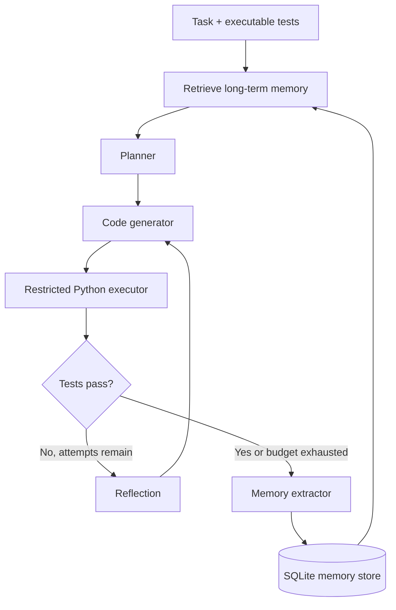

# MemCoder

**A memory-augmented coding agent with an auditable LangGraph workflow.**

MemCoder turns a coding request into a repeatable loop:

> Retrieve -> Plan -> Generate -> Execute -> Evaluate -> Reflect -> Store

It is a small research and engineering project for studying one question:

> Can structured long-term memory help a coding agent avoid repeating previous mistakes?

The repository deliberately keeps the agent scaffold understandable. Memory is not hidden behind a
hosted black box: records live in SQLite, retrieval scores are explainable, and the same benchmark can
run with memory disabled or enabled.

## Highlights

- Explicit LangGraph state machine with inspectable trajectory events.
- Automatic code generation, execution feedback, reflection, and bounded repair attempts.
- Episodic, semantic, and procedural memory records.
- Complete `write / retrieve / update / forget` memory lifecycle.
- Hybrid retrieval combining feature-hashed vectors, lexical overlap, importance, recency, and reuse.
- OpenAI Responses API structured output plus an OpenAI-compatible Chat Completions fallback.
- Secret-stripped, time- and resource-limited local Python executor.
- Deterministic offline demo and unit tests that require no API key.
- Paired no-memory/memory Benchmark with raw JSON output.

## Architecture



See [Architecture](docs/architecture.md) for state, storage, scoring, and trust-boundary details.

## Quick start

```bash
python3 -m venv .venv
source .venv/bin/activate
pip install -e '.[dev]'
pytest
memcoder demo
```

The offline demo intentionally introduces a heap tuple-order bug on the first cold run. Reflection fixes
it and stores the experience. On the next run, relevant memory is retrieved before generation, allowing
the deterministic demo model to avoid the same mistake.

Inspect what was learned:

```bash
memcoder memory list
memcoder memory search "Dijkstra heap ordering"
```

## Use a live model

Copy the example configuration and set an API key locally:

```bash
cp .env.example .env
```

For OpenAI, keep `MEMCODER_API_MODE=responses`. The client requests strict JSON-schema output and sets
`store=false`. For another OpenAI-compatible provider, use its `/v1` base URL and select
`MEMCODER_API_MODE=chat_completions` when it does not implement the Responses API.

```bash
memcoder solve \
  --task "Implement merge_intervals(intervals)" \
  --tests examples/tests/test_merge_intervals.py
```

The default embedding provider is a deterministic local feature-hashing baseline. Set
`MEMCODER_EMBEDDING_PROVIDER=api` to use the configured `/embeddings` endpoint.

## Run the ablation benchmark

```bash
memcoder benchmark \
  --dataset examples/benchmark/paired_python_tasks.jsonl \
  --output artifacts/benchmark.json \
  --repetitions 3
```

Reported metrics include final and first-attempt pass rates, average attempts, duration, token usage,
and memory hit rate. No model-performance numbers are committed to this repository: generate and report
results from your own controlled run. See [Benchmark methodology](docs/benchmark.md).

## Memory lifecycle

```bash
memcoder memory add semantic \
  "Python heap invariant" \
  "heapq pops the smallest first tuple element"
memcoder memory search "priority queue tuple order"
memcoder memory update <full-memory-id> --content "Updated verified fact"
memcoder memory forget <full-memory-id>
```

Every row stores provenance-oriented fields including type, task summary, error category, root cause,
solution, tags, importance, reuse count, embedding, and timestamps.

## Security boundary

Generated code is dangerous. The local executor removes inherited secrets, uses a disposable directory,
sets a timeout, truncates output, and applies Unix resource limits. It **does not** provide kernel-level
network or filesystem isolation. Run MemCoder itself in a disposable container or VM before evaluating
arbitrary third-party tasks. See [Security](SECURITY.md).

## Project layout

```text
src/memcoder/
├── agent/       # LangGraph workflow and prompts
├── benchmark/   # Dataset loader, ablation runner, metrics
├── execution/   # Disposable Python execution environment
├── memory/      # Embeddings, SQLite store, lifecycle manager
├── models/      # Structured model adapters and offline demo model
├── cli.py
├── config.py
└── domain.py
```